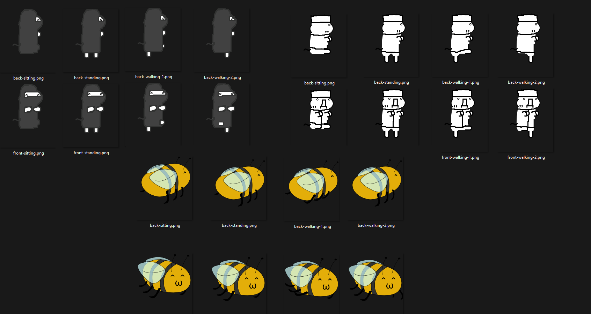

# Gikopoi: Illegal
A far-right extremist known only as "maf" has seen to it that
certain contributions to the Gikopoi community repo are rejected
for political & religious reasons. In the spirit of freedom,
creative expression, love, and community, the Gikopoipoipoipoi
(gikopoi4) developers have seen to it that these giko refugees
are given a safe space.

If you are an artist who has similarly faced discrimination at
the hands of "maf", worry no more -- we will accept nearly all
contributions. However, characters that go against one of our
values (freedom, creative expression, love, and community) may
face rejection, pending revisions or further discussion.

## Characters:
* shii_islam -- a Shii depicted in traditional female Islamic dress
* giko_islam -- a Giko depicted in traditional male Islamic dress
* mitsugiko -- a Giko who is a honeybee character!

## Developer chat
* #gikopoi @ irc.rizon.net
* #gikopoi:matrix.org

